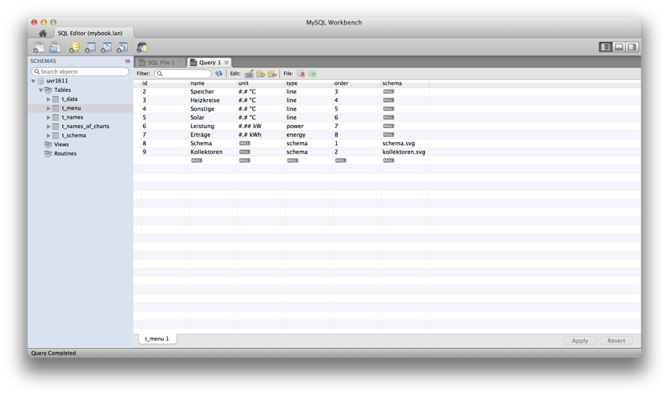
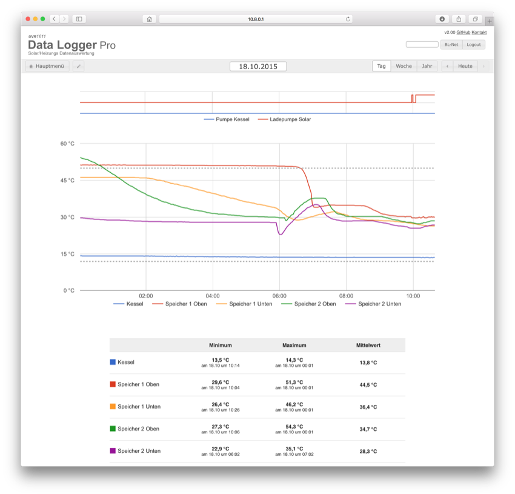
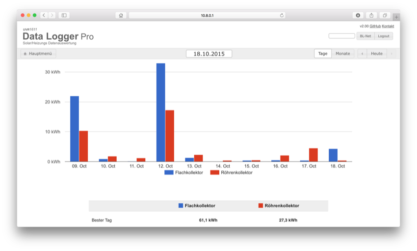

Achtung!
------

In der aktuellen Version hat sich die Datenbank Struktur geändert. Für die Migration alter Datensätze stehen im Ordner SQL Skripts zur Verfpgung.
*Vor der Migration unbedingt ein Backup der Daten anlegen!*
Zuerst die `table_migration.sql` ausführen um die Änderungen an den Tabellen durchzuführen und anschließend `data_migration.sql` zum Übertragen der Daten in die neuen Tabellen (Dies kann einige Minuten dauern). Eventuell muss nach der Migration die Tabelle `t_names_of_charts` angepasst werden.

UVR1611 Datalogger Pro
======

Der *UVR1611 Datalogger Pro* ist ein webbasierender Datenlogger für die Universalregelung UVR1611 von TA mithilfe des BL-NET über den CAN-Bus und DL.

Die Features sind:
* Datenlogging über CAN-Bus und DL in eine MySQL Datenbank
* Web-Interface
* Onlinegrafik
* Temperaturkurven (Tages und Wochenansicht)
* Leistungskurven (Tages und Wochenansicht)
* Ertragsdiagramme (Monats und Tagesgruppierung)
* Zoomen in den Diagrammen
* Übersichtstabellen zu den Diagrammen

<!--Ein Beispiel der Anwendung befindet sich hier: [Demo](http://berwinter.dyndns.org/uvr1611/)-->

Installation
------

Für die Anwendung wird ein Webserver mit PHP und ein MySQL Datenbank-Server benötigt. Die benötigten Pakete können unter Ubuntu mit folgendem Befehl installiert werden:

	sudo apt-get install lighttpd php5-cgi mysql-server mysql-client

Danach kann die Anwendung in den Ordner `/var/www/` kopiert werden. Zum erstellen der Datenbankstruktur kann das Skript `sql/structure.sql` importiert werden. 

Die Anwendung benütigt zur Laufzeit Schreibrechte für den Ordner `/tmp/`.

Konfiguration
------

Die Konfiguration des Datenloggers befindet sich in der Datei `config/config.ini`:
 
	[mysql]
	server = localhost
	user = uvr1611
	password = uvr1611
	database = uvr1611
	
	[uvr1611]
	address = 10.0.0.100
	port = 40000
	reset = false
	
	[app]
	chartcache = 600
	latestcache = 60
	reduction = 2

In der Sektion `mysql` befinden sich die Parameter für den Zugang zur Datenbank und in `uvr1611` die IP-Adresse für den BL-NET. Mit dem Schalter `reset` kann das Löschen der Daten vom BL-NET nach dem Logging aktiviert werden. Der Bereich `app` legt Einstellungen zur Anwendung fest. `chartcache` und `latestcache` legen den Zeitraum in Sekunden fest, in dem keine neuen Daten vom Bootloader geholt werden.  `reduction` reduziert die Daten in den Diagrammen um den angegebenen Faktor.

Anpassen der Anwendung
------

Die Anpassung der Anwendung erfolgt vollständig über die Datenbank:

#### t_menu ####

#### t_names ####

#### t_names_of_charts ####

#### t_schema ####

Die angezeigten Werte im Schema können in der Tabelle `t_schema` angepasst werden. Dazu musst der Pfad des `t_span` Elements in der SVG Grafik angebenen werden, welches den aktuellen Wert enthalten soll. Als Formatierung kann die Anzahl der Kommastellen angegenem werden (zB.: #.## für 2 Kommastellen). Für die digitalen Ausgänge kann die Funktion `DIGITAL()` verwendet werden um EIN bzw. AUS im Schema anzuzeigen. Für die Darstellung der Erträge stehen die Funktionen `MWH()` und `KWH()` zur Verfügung.

Screenshots
------

Kontakt
------
Bertram Winter
bertram.winter@gmail.com
